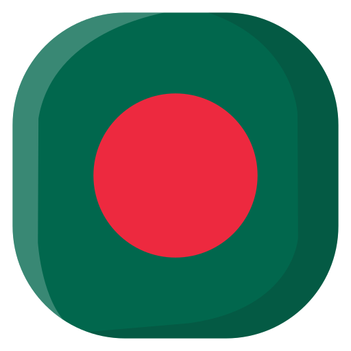

##  Hey! Nice to see you.

Welcome to my page! </br> I'm <b>MD. Shimul</b>, Fullstack developer from  <b>Dhaka, Bangladesh</b>.</p>

- 🔭 I’m currently working at [Fibre-Optic Cable Management Map Software For ISP](https://github.com/mdshemul48/fiber-network-management-tool-for-isp)
- 💻 Most used line of code `()=> {}`
- 🤔 I’m looking for some project to work.
- 📫 How to reach me: mdshemul480@gmail.com.


[](https://mdshemul48.netlify.app)
[](https://www.linkedin.com/in/mdshemul48/)
[](http://www.facebook.com/mdshemul48)


### Languages and Tools:


### GitHub Stats


### Coding Stats

<!--START_SECTION:waka-->

```text
From: 12 September 2022 - To: 19 September 2022

JavaScript       13 hrs 35 mins  ⣿⣿⣿⣿⣿⣿⣿⣿⣿⣿⣿⣿⣿⣿⣿⣿⣿⣿⣦⣀⣀⣀⣀⣀⣀   74.14 %
Blade Template   2 hrs 27 mins   ⣿⣿⣿⣤⣀⣀⣀⣀⣀⣀⣀⣀⣀⣀⣀⣀⣀⣀⣀⣀⣀⣀⣀⣀⣀   13.42 %
PHP              1 hr 5 mins     ⣿⣦⣀⣀⣀⣀⣀⣀⣀⣀⣀⣀⣀⣀⣀⣀⣀⣀⣀⣀⣀⣀⣀⣀⣀   05.99 %
CSS              55 mins         ⣿⣤⣀⣀⣀⣀⣀⣀⣀⣀⣀⣀⣀⣀⣀⣀⣀⣀⣀⣀⣀⣀⣀⣀⣀   05.08 %
Other            7 mins          ⣄⣀⣀⣀⣀⣀⣀⣀⣀⣀⣀⣀⣀⣀⣀⣀⣀⣀⣀⣀⣀⣀⣀⣀⣀   00.68 %
```

<!--END_SECTION:waka-->
